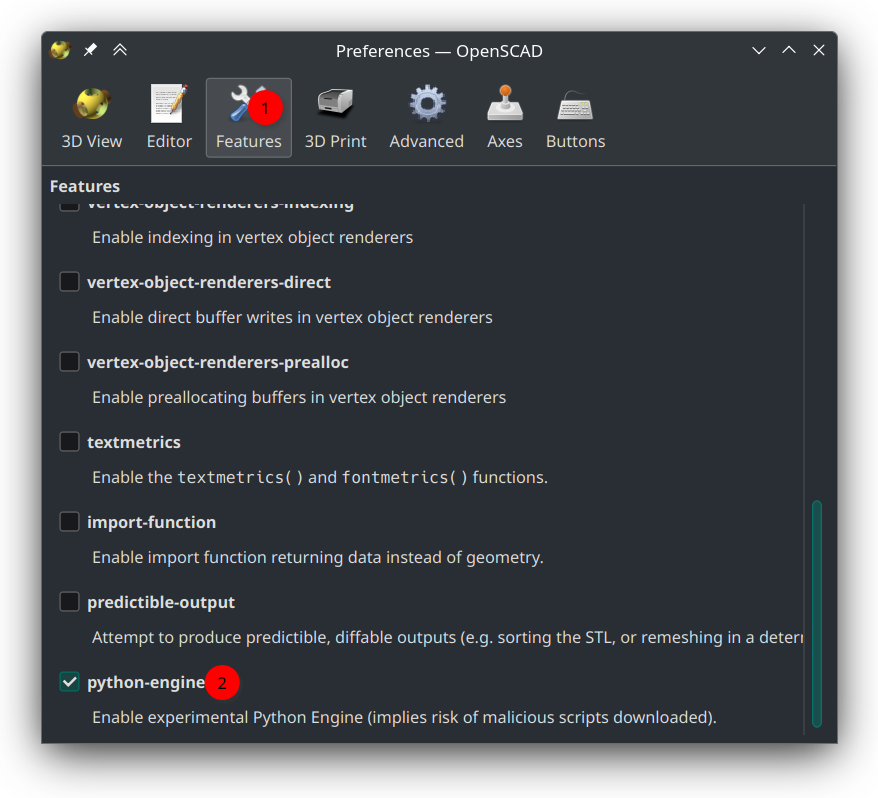

# Getting started with Python-powered OpenSCAD

## Enabling Python support
For Python support to be enabled, 2 conditions must be met:

1. The `python-engine` feature must be enabled

2. The extension of the file you're editing **MUST** be `.py`.

If both those condition are met, then the file will be interpreted as a Python file.

## Differences with regular OpenSCAD
If you're familiar with regular OpenSCAD, then the synthax will be fairly obvious, as the names of functions and classes are the same.

The major difference is that you need to use the `output()` function for a shape to be displayed, as opposed to it being displayed automatically in regular OpenSCAD. As for every python library, you need to  import the functions with 'inport'. Put this in the beginning of each script.

## Creating a basic shape
Lets create a 5x5x5 cube.

=== "Python"

    ```py
    # getting openscad functions into namespace
    from openscad import *

    # Create the cube object, and store it in variable "c"
    c = cube(5)
    # Or, more explicitely
    c = cube([5,5,5])

    # Display the cube
    output(c)
    ```

=== "OpenSCAD"

    ```c++
    // Create the cube object
    cube(5);
    // Or, more explicitely
    cube([5,5,5]);

    // The cube is displayed implicitely
    ```

That was pretty easy!
Next, let's see how to [combine multiple shapes](./combining_objects.md).
